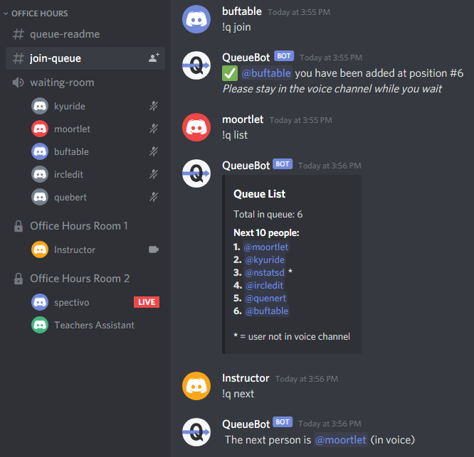
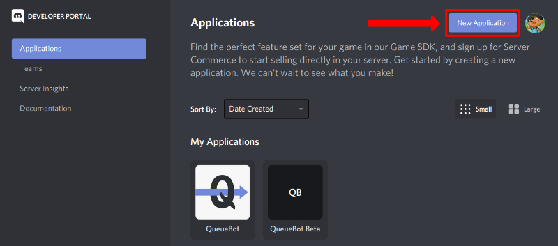
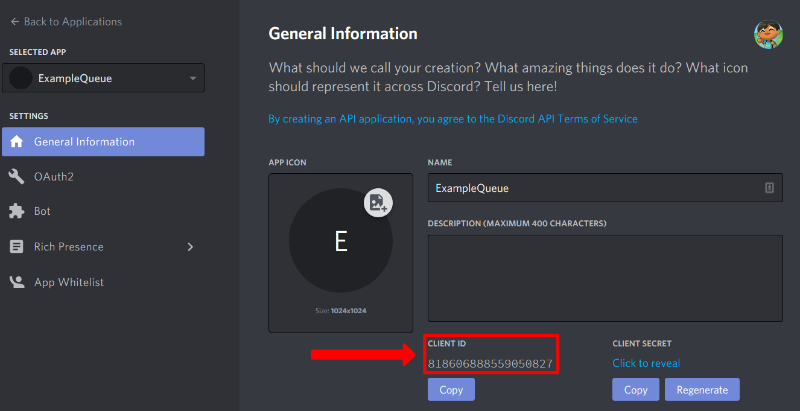
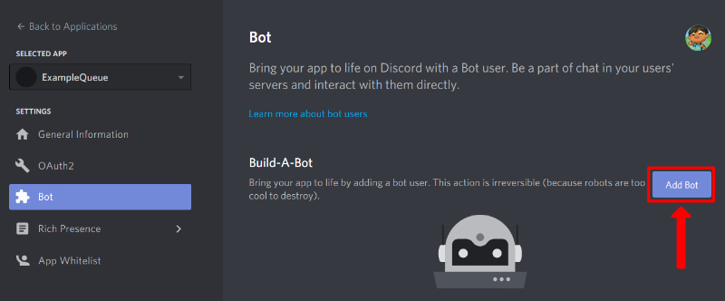
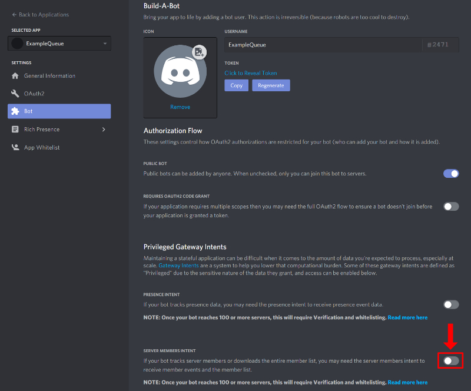
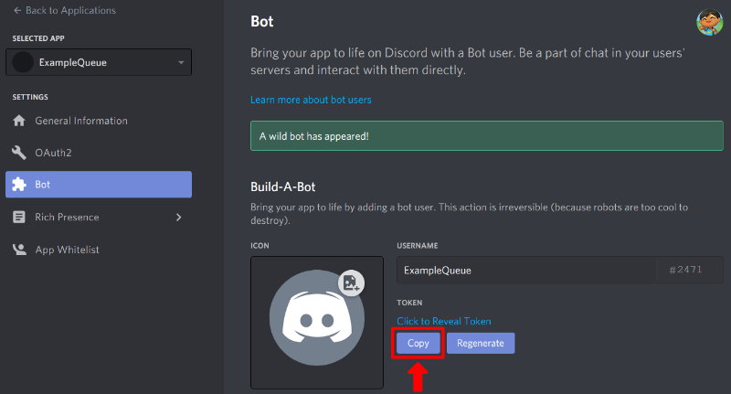

# QueueBot


QueueBot is an IRC-like bot for Discord. It is used to facilitate online Office Hours (hence the use of terms like "Instructor" and "TAs") by keeping track of students in a queue.

## Notes and Stuff

Source code for QueueBot is within the [src/](src/) directory.
If you don't know where to run the bot, try running it on [Lectura](#running-the-bot-on-a-linux-machine-ie-lectura)

Here are some notes about things I wanted to do but didn't get around to finishing it:

- The `py-cord` dependency should probably be updated (need to check for breaking changes)
- `test/` contains unit test cases which are out of date and likely need to be redone
- `README.md` should probably be split into multiple separate files and put into a `docs/` directory
- The bot should be able to reply to a specific message instead of @ing the user in a new message (example can be found in [reply_to_msg.py](reply_to_msg.py))
- The bot should notify a student if they are in the waiting room but not the queue (this should be run as a background task. See [background_tasks.py](background_tasks.py))

## Table of Contents

- [QueueBot](#queuebot)
  - [Notes and Stuff](#notes-and-stuff)
  - [Table of Contents](#table-of-contents)
  - [QueueBot in Action](#queuebot-in-action)
  - [Creating Discord Bot](#creating-discord-bot)
  - [Project Setup](#project-setup)
    - [Running with Command Line](#running-with-command-line)
      - [Starting the Bot](#starting-the-bot)
    - [Running with Docker](#running-with-docker)
      - [Use Prebuilt Container](#use-prebuilt-container)
      - [Manually Build Container](#manually-build-container)
  - [Configuration](#configuration)
    - [Modifying the Config](#modifying-the-config)
      - [Config Options](#config-options)
      - [Example Config](#example-config)
        - [JSON](#json)
    - [Bot Commands](#bot-commands)
    - [Running the Bot on a Linux Machine (ie. Lectura)](#running-the-bot-on-a-linux-machine-ie-lectura)
    - [Running Unit Tests](#running-unit-tests)
      - [Running All Unit Tests](#running-all-unit-tests)
      - [Running a Specific Unit Test File](#running-a-specific-unit-test-file)
      - [Running Specific Unit Test Method](#running-specific-unit-test-method)
    - [Checking Coverage](#checking-coverage)

## QueueBot in Action



## Creating Discord Bot

Before configuring the bot, it needs to be added to the appropriate discord server.
1. Go to [Discord's developer portal](https://discord.com/developers/applications) and create a new application (top-right button).  

2. Under the `General Information tab`, take a note of the Client ID as it will be used in step 5  

3. On the left panel, click the `Bot` category then the `Add a Bot` button to convert the application to a bot account  

4. Name it, give it a profile picture, etc.
     - Enable the "Server Members Intent" option under the "Privileged Gateway Intents"
         if you intend on enabling the config values [`CHECK_VOICE_WAITING`](#modifying-the-config) or [`ALERT_ON_FIRST_JOIN`](#modifying-the-config)

5. Obtain your bot's Token by clicking the `Copy` button and save it for future reference (referred to as `SECRET_TOKEN` within the [configuration](#modifying-the-config) section).  
**NOTE: The token is effectively your bot's password. Keep it secure and do not share it.**  

5. Open the following link in your preferred browser and after changing the `client_id` parameter in the url with the Client ID you saved from step 2
```bash
# Swap out REPLACE_WITH_YOUR_CLIENT_ID with the correct Client ID from step 2
https://discord.com/api/oauth2/authorize?scope=bot&permissions=2147575872&client_id=REPLACE_WITH_YOUR_CLIENT_ID

2416011344 -> Manage Roles, Manage Channels, Send Messages, Manage Messages, Embed Links, Read Message History, Add Reactions, Use Slash Commands
```
> Permissions are the following: Permissoins: Send Messages, Manage Messages, Embed Links, Read Message History, Add Reactions, Use Slash Commands
1. Choose the server you want the bot to join and accept.

> NOTE: While it is possible to add the same bot account to multiple servers, it will only listen to the first server it joins

## Project Setup

The bot can be run like a normal command line application or within a Docker container. Each method uses a different way to configure the bot.

### Running with Command Line

> Note: On Linux you may need to use `python3` if the `python` command runs Python 2

0. Ensure you have Python 3.7+ installed
1. Clone/Download this repository
2. Extract and `cd` into the repo folder
3. Create a Python virtual environment (skip if on lectura since it doesn't have the required package)
   - `py -3 -m venv venv`
   - On Linux, You may need to install the `python3-venv` package for this to work
4. Activate the virtual environment
   - Windows: `venv\Scripts\activate.bat`
   - Linux: `source venv/bin/activate`
   - Once activated, `python` and `pip` will point to the virtual environment executables
5. Upgrade virtual environment pip
   - `python -m pip install --upgrade pip`
6. Install queuebot required packages
   - `pip install -r requirements-prod.txt`
7. Generate `config.json` by running the bot for the first time
   - `python queuebot.py`
8. Move on to [Modifying the Config](#modifying-the-config)

#### Starting the Bot

Once the project is set up, you simply need to activate the python virtual environment ([see step 4 above](#project-setup)) then run the program with `python queuebot.py`

### Running with Docker

#### Use Prebuilt Container

Simply import from the github registry:

```bash
docker pull docker.pkg.github.com/benperumala/cs120-queuebot/queuebot:latest
```

#### Manually Build Container

1. Ensure you have Docker installed and set up
2. Clone this repository
3. `cd` into the repo folder
4. Build the docker image
   - `docker build -t queuebot:latest .`
5. Move on to [Modifying the Config](#modifying-the-config)

## Configuration

### Modifying the Config

> **Docker Users:** The container uses the same `config.json` file as the regular bot. However, it must be mounted within the `/data` directory. This can be done via the `-v` flag when doing `docker run`.

#### Config Options

| Name                  | Type | Description  |
|-----------------------|------|--------------|
| SECRET_TOKEN          | String | Discord Token which the bot uses for authentication (see [Creating Discord Bot](#creating-discord-bot) on how to get it). |
| TA_ROLES              | List | A list of discord roles which signify TAs/Instructors. Users with any of these roles can run TA commands. |
| LISTEN_CHANNELS       | List | A list of text channels which the bot will listen in for queries. |
| CHECK_VOICE_WAITING   | Boolean | When enabled, the bot will only allow people to join the queue when they have joined a voice channel (specified with `VOICE_WAITING` option). |
| VOICE_WAITING         | String | Specifies which voice channel students will join while they wait for a TA to become available. Does not need to be populated if `CHECK_VOICE_WAITING` is False. |
| ALERT_ON_FIRST_JOIN   | Boolean | Alert available TAs when somone first joins the queue (Only TAs with 0 students in the same room will be notified)  |
| ALERTS_CHANNEL        | String | Text channel the bot will send alerts in. Currently, `ALERT_ON_FIRST_JOIN` is the only item to create alerts.  |
| VOICE_OFFICES         | List | Specifies the channels to search for available TAs. TAs in rooms without any students will be notified if someone enters the queue. Does not need to be specified when `ALERT_ON_FIRST_JOIN` is False. |

#### Example Config

The following config accepts users with the role `UGTA` as a TA role. Anyone who has this role can run TA-level commands. The bot will listen for commands in the `#join-queue` text channel and `waiting-room` voice channel. Because `CHECK_VOICE_WAITING` is enabled, it requires students to join the `waiting-room` voice channel before running `!q join`.

Since `ALERT_ON_FIRST_JOIN` is enabled, the bot will check voice rooms `Office Hours Room 1` and `Office Hours Room 2` for TAs to notify when a student joins the queue. If it finds any rooms with available TAs (there are no students within the office hours room), it will notify them in the `#queue-alerts` text channel.

##### JSON

```json
{
    "SECRET_TOKEN": "[YOUR SECRET TOKEN HERE]",
    "TA_ROLES": ["UGTA"],
    "LISTEN_CHANNELS": ["join-queue"],
    "CHECK_VOICE_WAITING": "True",
    "VOICE_WAITING": "waiting-room",
    "ALERT_ON_FIRST_JOIN": "True",
    "ALERTS_CHANNEL": "queue-alerts",
    "VOICE_OFFICES": ["Office Hours Room 1", "Office Hours Room 2"]
}
```

### Bot Commands

Managing the queue is done by sending text commands in the discord server (like an IRC bot). If sent to a channel that the bot is set to listen to, the bot will then perform the given command. A command always starts by having `!q ` at the beginning of the message. Below is a table showing all available commands.

The bot has two permission levels: `Everyone` and `TA`. Commands with the `Everyone` permission can be run by (as the name suggests) anyone. Getting a list of users in the queue with `!q list` is an example of such command. `!q next`, on the other hand requires the user to have a role that is considered to be a `TA` role (See [Modifying the Config](#modifying-the-config) for more info).

| Command            | Level    | Description  |
|--------------------|----------|--------------|
| `!q help`          | Everyone | Sends a Direct Message to the user which lists commands they can run |
| `!q ping`          | Everyone | Bot replies with `Pong!`. Used to ensure both is receving/sending messages |
| `!q join`          | Everyone | Adds the user who ran the command to the queue |
| `!q leave`         | Everyone | Removes the user who ran the command from the queue |
| `!q position`      | Everyone | Responds with the number of people in the queue who are in front of the person who ran the command |
| `!q list`          | Everyone | Lists the next 10 people within the queue |
| `!q next`          | TA       | Responds with the person who is next in line and **removes** them from the queue |
| `!q peek`          | TA       | Responds with the person who is next in line **WITHOUT removing** them from the queue |
| `!q clear`         | TA       | Empties the queue (requires a TA to confirm by reacting to response message) |
| `!q front @user`   | TA       | Adds `@user` to the **front** of the queue (the TA must mention said user) |
| `!q add @user`     | TA       | Adds `@user` to the **end** of the queue (the TA must mention said user) |
| `!q remove @user`  | TA       | Removes `@user` from the queue (the TA must mention said user) |


### Running the Bot on a Linux Machine (ie. Lectura)

Assuming the code is already on the system, the `screen` command can be used to create a lasting terminal session.
1. Create a new "screen" which will run the bot
```bash
# Create a new screen
screen -S QueueBot
cd <path/to/queuebot/code>
# Run the bot
python3 queuebot.py
```

To "detach" from the screen, press `Ctrl-A-D`. This will keep the process running in the background.  
To reattach to the screen run `screen -r QueueBot`. A list of all created screens can be shown by running `screen -list`

> NOTE: Lectura may kill long lasting processes (I haven't looked into it much). If this is the case, an Amazon AWS EC2 instance can be used. Upon creating an AWS account, you get 1 year free for the `t2.micro` machine. Contact me (Ben P) or Russ for more info.

### Running Unit Tests

This project uses Python's build in `unittest` library for unit testing. To run the tests, the [Python virtual environment must be activated](#project-setup)

#### Running All Unit Tests

Python's unittest module can simply be invoked. It will automatically locate the unittest folder

```bash
python -m unittest
```

#### Running a Specific Unit Test File

Replace `TEST_FILE` with the respective file

```bash
python -m unittest test/TEST_FILE.py
```

#### Running Specific Unit Test Method

Replace `TEST_FILE` and `METHOD_NAME` with the respective file and method

```bash
python -m unittest test.TEST_FILE.QueueTest.METHOD_NAME
```

### Checking Coverage

To get coverage, the [Python virtual environment must be activated](#project-setup)

[run-coverage.bat](run-coverage.bat) can be run on Windows. For other operating systems, run the following commands:

```bash
coverage run --omit 'venv/*' -m unittest
coverage xml -o cov.xml
```

`cov.xml` should now contain coverage information. `coverage html` can be run afterwards to get a HTML report of the coverage (files are generated in the `htmlcov/` folder)
